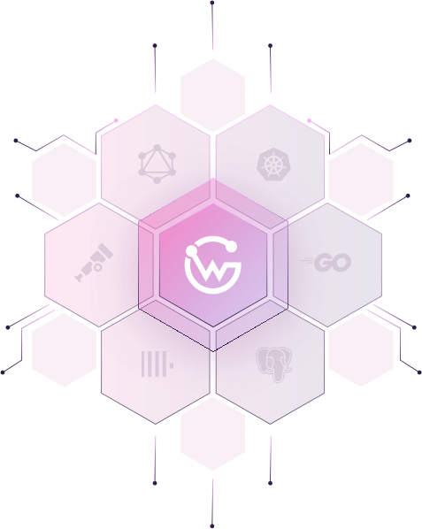
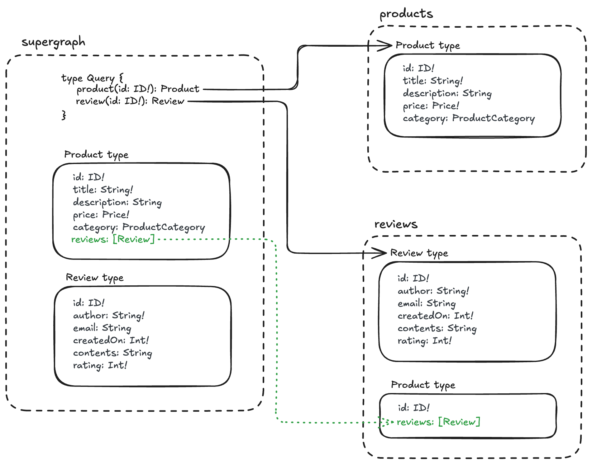

<p align="center">

</p>

<div align="center">
<h5>WunderGraph Cosmo - The GraphQL Federation Platform</h5>
<h6><i>Reach for the stars, ignite your cosmo!</i></h6>
</div>

<p align="center">
  <a href="https://cosmo-docs.wundergraph.com/getting-started/cosmo-cloud-onboarding"><strong>Quickstart</strong></a> ·
  <a href="https://github.com/wundergraph/cosmo/tree/main/examples"><strong>Examples</strong></a> ·
  <a href="https://cosmo-docs.wundergraph.com"><strong>Docs</strong></a> ·
  <a href="https://cosmo-docs.wundergraph.com/cli"><strong>CLI</strong></a> ·
  <a href="https://wundergraph.com/discord"><strong>Community</strong></a> ·
  <a href="https://github.com/wundergraph/cosmo/releases"><strong>Changelog</strong></a> ·
  <a href="https://wundergraph.com/jobs"><strong>Hiring</strong></a>
</p>

<p align="center">
  <a href="https://human-oss.dev"></a>
</p>

## Overview

WunderGraph Cosmo is a comprehensive Lifecycle API Management platform tailored for Federated GraphQL. It encompasses everything from Schema Registry, composition checks, and analytics, to metrics, tracing, and routing. Whether you’re looking to deploy 100% on-prem or prefer a [Managed Service](https://cosmo.wundergraph.com/login), Cosmo offers flexibility without vendor lock-in, all under the Apache 2.0 license.

## Onboarding

This repository contains demo subgraphs implemented as [Cosmo Router plugins](https://cosmo-docs.wundergraph.com/router/gRPC/plugins). These subgraphs are used to onboard users to the Cosmo platform with the `wgc demo` command.

The subgraphs model part of a fictional e-commerce business with `Product` and `Review` entities. The federated graph consists of queries and federated entities that look like this:

<p align="center">
    
</p>

The root query exposes `product(id: ID!): Product` and `review(id: ID!): Review`. The `reviews` subgraph contributes an additional field to the `Product` type, `reviews: [Review]`, which returns the list of reviews for a product.

<details>
    <summary>⚙️How does it work under the hood?</summary>

The `demo` command fetches the `plugins/` folder during its setup phase. The command then publishes these plugins to the [Cosmo Cloud Plugin Registry](https://cosmo-docs.wundergraph.com/router/gRPC/plugins#cosmo-cloud-plugin-registry). By publishing the plugins, the subgraphs are created in a predefined federated graph.
The command then runs the official Cosmo Router Docker image, which connects to the registry, pulls the published plugins, and executes them so the queries can be resolved with mocked data.
</details>

## Quickstart

Run `wgc demo` and make sure you are logged in to your Cosmo Cloud account. Follow the instructions in the web application and CLI.

### Implementing `averageRating` field

1. Fork this repo.
2. Add `ROUTER_TOKEN` to your CI secrets (TBD - Github workflow)
3. In `plugins/reviews/src/schema.graphql` expand the schema file:

```diff
@@ -16,6 +16,7 @@ Entity describing a product with reviews
 type Product @key(fields: "id") {
   id: ID!
   reviews: [Review]
+  averageRating: Float
 }
```

4. Run `make generate` in `plugins/reviews` directory to generate gRPC methods.
5. Add the new field `AverageRating` to the `Product` struct, using `calculateAverageRating` function that is provided:

```diff
@@ -62,6 +62,7 @@ func (s *ReviewsService) LookupProductById(ctx context.Context, req *service.Loo
                                        Items: items,
                                },
                        },
+                       AverageRating: wrapperspb.Double(calculateAverageRating(items)),
                }
        }
        return &service.LookupProductByIdResponse{Result: result}, nil
```

6. Create a pull request in your fork. Ensure checks pass.
7. Merging the pull request will publish new version of the schema and plugin to Cosmo Cloud Plugin Registry.
8. Query the new field! 🎉

## Development

### Prerequisites

Make sure you have [make](https://www.gnu.org/software/make/) and [pnpm](https://pnpm.io/) installed. You will also need a Go toolchain, ideally with [golangci-lint](https://golangci-lint.run/) as well.
This project uses `pnpm@10.29.3` (defined in `packageManager`). The easiest way to get the right version is via [Corepack](https://nodejs.org/api/corepack.html), which ships with Node.js:

```shell
corepack enable
corepack install
```

1. Run `pnpm install` to install the dependencies.
2. Run `make start` to build and run the router image.
3. Visit [http://localhost:3002](http://localhost:3002) to use the playground.
4. Optional: execute an example query with `curl`:

```shell
curl -s -X POST http://localhost:3002/graphql -H 'Content-Type: application/json' -d '{"query":"query GetProductWithReviews($id: ID\u0021) { product(id: $id) { id title price { currency amount } reviews { id author rating contents } } }","variables":{"id":"product-1"}}'
```

### Local development with Cosmo

This workflow is useful if you want to test the plugins against a local instance of the Cosmo platform.
For more information, see [how to develop the Cosmo platform locally](https://github.com/wundergraph/cosmo/blob/main/CONTRIBUTING.md#local-development).

Run the following steps in the directory where you cloned `wundergraph/cosmo`:

1. Start the Cosmo platform.
2. Create federated graph ([documentation](https://cosmo-docs.wundergraph.com/cli/federated-graph/create)): `pnpm wgc federated-graph create --routing-url http://localhost:3002/graphql onboarding`
3. Create subgraphs ([documentation](https://cosmo-docs.wundergraph.com/cli/subgraph/create)):

```shell
pnpm wgc subgraph create --routing-url http://localhost:3002/graphql products
pnpm wgc subgraph create --routing-url http://localhost:3002/graphql reviews
```

4. Publish the subgraphs ([documentation](https://cosmo-docs.wundergraph.com/cli/subgraph/publish)). Replace `<cosmo-onboarding-repo-path>` with a relative path to the directory where you cloned this repository:

```shell
pnpm wgc subgraph publish products --schema <cosmo-onboarding-repo-path>/plugins/products/src/schema.graphql
pnpm wgc subgraph publish reviews --schema <cosmo-onboarding-repo-path>/plugins/reviews/src/schema.graphql
```

5. Create a [router token](https://cosmo-docs.wundergraph.com/getting-started/cosmo-cloud-onboarding#create-a-router-token) and store it in a secure place.

Run the following steps in the directory where you cloned this repository:

1. Build the image with `make docker-local`.
2. Run the image. Replace `<token>` with the token you generated in step 5 above.

```shell
docker run --rm -p 3002:3002 -e GRAPH_API_TOKEN=<token> -e LOG_LEVEL=info cosmo-demo-local
```

Other useful `make` targets:

* `make build` - build the plugins and router configuration
* `make compose` - generate the router execution config
* `make docker-local` - build a development version of the Docker image
